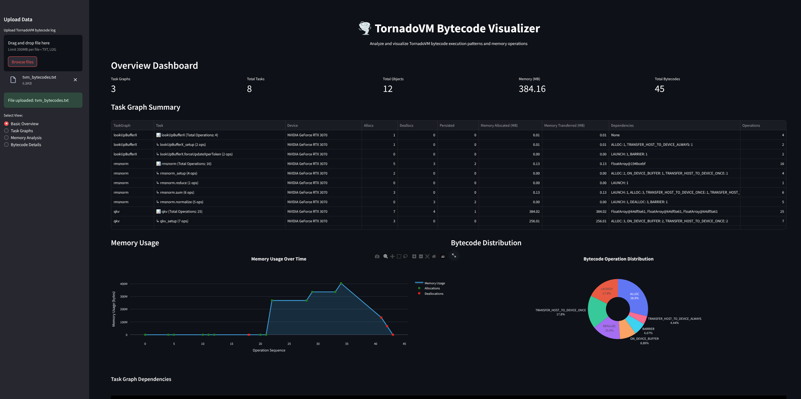
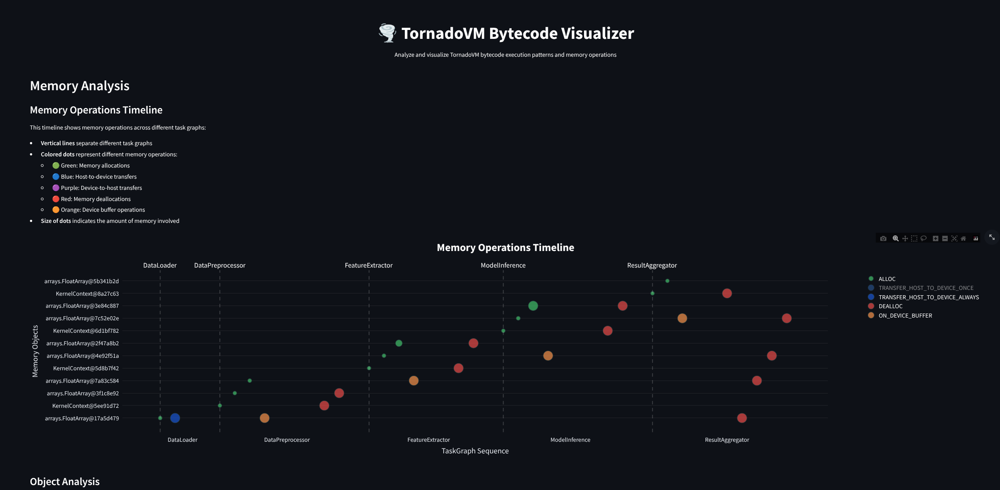
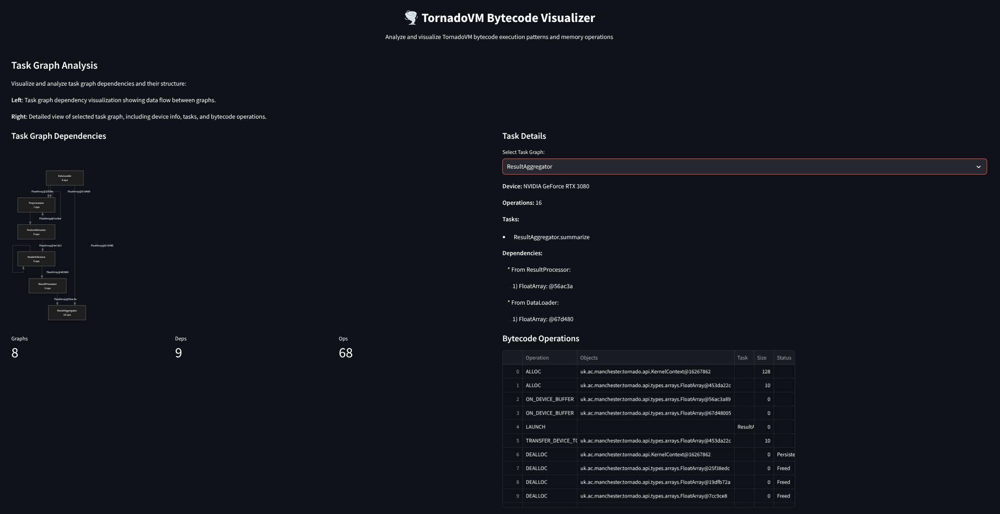

# TornadoVM Bytecode Analyzer 

A visualization and analysis tool for TornadoVM bytecode execution logs that helps developers understand and optimize their applications running on [TornadoVM](https://github.com/beehive-lab/TornadoVM).

## Overview

The TornadoVM Bytecode Analyzer provides interactive visualizations and detailed analysis of task graphs, memory operations, and bytecode execution patterns. This helps developers optimize their applications and understand data flow between tasks.


## Features

### Task Graph Analysis
- Visualize task graph dependencies and execution flow
- Analyze memory operations and data transfers between tasks
- Track object lifecycles across different task graphs
- Identify memory allocation patterns and potential bottlenecks

### Memory Analysis
The tool provides detailed memory operation analysis:



- **Memory Timeline**: Track memory operations across task graphs with:
  - 🟢 Memory allocations
  - 🔵 Host-to-device transfers
  - 🟣 Device-to-host transfers
  - 🔴 Memory deallocations
  - 🟠 Device buffer operations

- **Object Lifecycle**: Follow individual objects through their complete lifecycle
- **Memory Usage**: Monitor total memory usage and allocation patterns
- **Object Persistence**: Analyze object retention and deallocation patterns

### Bytecode Details
- Detailed view of all bytecode operations
- Filter and search capabilities
- Operation distribution analysis
- Task-specific operation breakdowns

## Task Graph Analysis

The Task Graph Analysis view provides insights into the execution flow and memory operations of your TornadoVM application:

- **Task Graph Dependencies**: Visualize how different task graphs depend on each other and the data flow between them
- **Memory Timeline**: Track memory allocations, deallocations, and overall memory usage across task graphs
- **Task Details**: Examine individual tasks, their operations, and memory patterns

<p align="center">
  
</p>

The visualization shows:
- Vertical lines separating different task graphs
- Memory usage over time (blue line)
- Allocations (green dots) and deallocations (red X)
- Task boundaries and execution sequence

## Installation

### Prerequisites
- Python 3.8 or higher
- pip (Python package installer)

### Setup

1. Clone the TornadoVM repository:
```bash
git clone https://github.com/beehive-lab/TornadoVM.git
```

2. Install dependencies:
```bash
pip install -r requirements.txt
```

3. Run the analyzer:
```bash
streamlit run tornado-visualizer-fixed.py
```

## Contributing

This tool is part of the TornadoVM project. For contributions, please follow the [TornadoVM contribution guidelines](https://github.com/beehive-lab/TornadoVM/blob/master/CONTRIBUTING.md).
